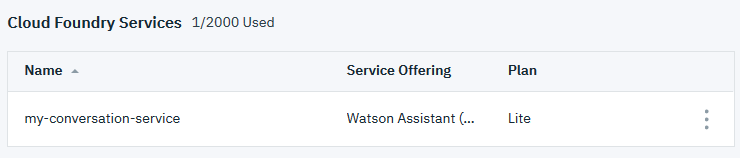
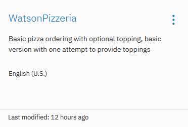
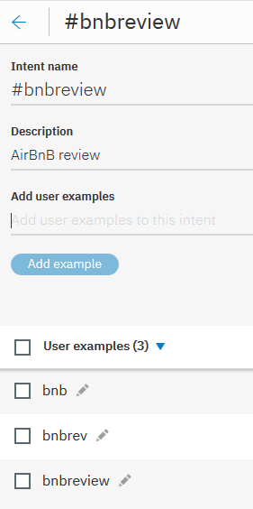

# Combination of IBM Watson Assistant and Discovery services

When both Watson Assistant and Discovery service are used to build solution, the most common questions/requests are typically covered by the Watson Assistant service. The Watson Discovery service covers subjects that the Assistant service has not been trained.

Up to now, you should have two working code patterns.
* [Creating a Pizza ordering Chatbot using Watson Assistant Slots feature](https://github.com/IBM/watson-conversation-slots-intro/)
* [Develop a fully featured Node.js web app built on the Watson Discovery Service](https://github.com/IBM/watson-discovery-ui?cm_sp=Developer-_-develop-a-fully-featured-web-app-built-on-the-watson-discovery-service-_-Get-the-Code)

After completed the code patterns for Watson Assistant and Watson Discovery, you have basic understanding of building a chatbot and unlock insight of unstructured information. Combination of the two Watson services can bring tremendous value to your business.

With couple of simple configuration and code changes, you can build a solution based on both Watson Assistant and Watson Discovery.

> Note, All changes are made to code pattern [Creating a Pizza ordering Chatbot using Watson Assistant Slots feature](https://github.com/IBM/watson-conversation-slots-intro/).


## Flow
1. Add a new intent to Watson Assistant
1. Add new environment variables to .env file
1. Modify code in app.js file


# Steps

Complete steps in the section to have a solution building on top of Watson Assistant and Discovery services.


## Adding a new Intent to the Watson Assistant

1. In your browser, navigate to the [IBM Cloud console](https://console.ng.bluemix.net/dashboard/services).

1. Select the Watson Assistant service in the `Cloud Foundry Services` section. It was created by the code pattern [Creating a Pizza ordering Chatbot using Watson Assistant Slots feature](https://github.com/IBM/watson-conversation-slots-intro/).

    

1. On the next page, click `Launch tool`.

1. In the Watson Assistant page, navigate to `Workspace` tab.

1. Select `WatsonPizzeria` tile. 

    

1. Select `Add intent` button.

1. Enter `bnbreview` as the Intent name and `AirBnB review` as the Description. 

1. Select the `Create intent` button. 

1. Add `bnb`, `bnbrev` and `bnbreview` as examples.

    


## Configuring the Watson Assistant service environment

1. Open the `.env_assistant_discovery` file in `watson-assistant-discovery` folder.

1. Copy entries of the Watson Discovery environment variables

    ```bash
    # Watson Discovery
    # Entries in this section should be populated and added to .env file in "watson-conversation-slots-intro" folder
    DISCOVERY_URL=https://gateway.watsonplatform.net/discovery/api/v1
    DISCOVERY_ENVIRONMENT_ID=<DISCOVERY_ENVIRONMENT_ID>
    DISCOVERY_COLLECTION_ID=<DISCOVERY_COLLECTION_ID>
    DISCOVERY_USERNAME=<DISCOVERY_USERNAME>
    DISCOVERY_PASSWORD=<DISCOVERY_PASSWORD>
    ```

1. Add the same entries to .env file in `watson-conversation-slots-intro` folder.

1. Save .env file.


## Modifying code in app.js

1. Open a command window.

1. Navigate to `watson-conversation-slots-intro` folder.

1. Execute

    ```bash
    copy app.js app_bak.js or
    cp app.js app_bak.js
    ```

1. Copt app.js in `watson-assistant-discovery` folder and replace the same file in `watson-conversation-slots-intro` folder.


## Test

When both Watson Assistant and Discovery service are used to build solution, the most common questions/requests are typically covered by the Watson Assistant service. The Watson Discovery service covers subjects that the Assistant service has not been trained.

To see how the application is working now,

1. Open a command window.

1. Navigate to `watson-conversation-slots-intro` folder.

1. Execute

    ```bash
    npm start
    ```

1. In a browser, enter localhost:3000

1. Ordering Pizza use case still works as it used to.

1. At any time, you may enter phrase `bnb Shoal Creek`. 

1. Watson Assistant identifies the intent `bnbreview`. However, it does not know what to do. Node.js code changes in app.js file takes the phrase and sends to Watson Discovery service for related insight. Portion of the Discovery search result is displayed throug UI as feedback to end user.


## Troubleshooting

If you encounter a problem, you can check the logs for more information. To see the logs, run the `cf logs` command:

```bash
cf logs <application-name> --recent
```


## License

This sample code is licensed under Apache 2.0. Full license text is available in [LICENSE](LICENSE).


## Contributing

See [CONTRIBUTING](CONTRIBUTING.md).


## Links

* [Cloud_Foundry CLI](https://github.com/cloudfoundry/cli#downloads)
* [Live Demo_URL](http://maximobot.mybluemix.net/)
* [Watson Assistant Documentation](https://console.bluemix.net/docs/services/conversation/getting-started.html#gettingstarted)
* [Watson Discovery Documentation](https://console.bluemix.net/docs/services/discovery/getting-started.html#gettingstarted)
* [Node.JS](http://nodejs.org/)
* [NPM](https://www.npmjs.com/)
